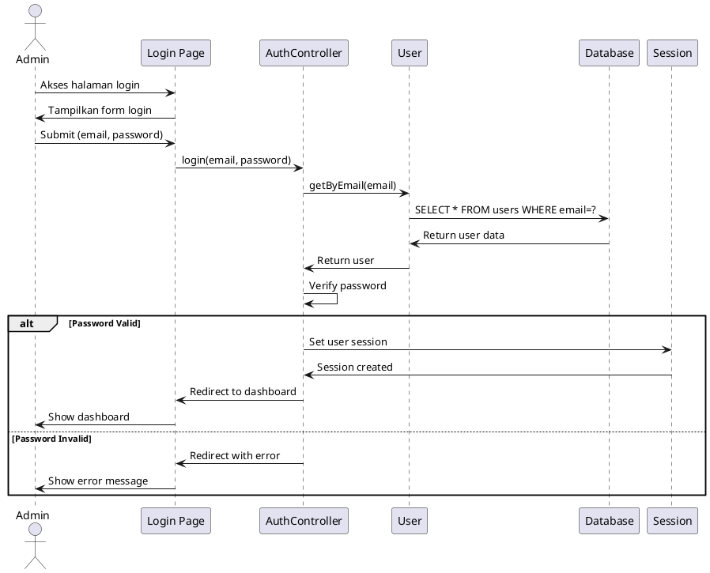
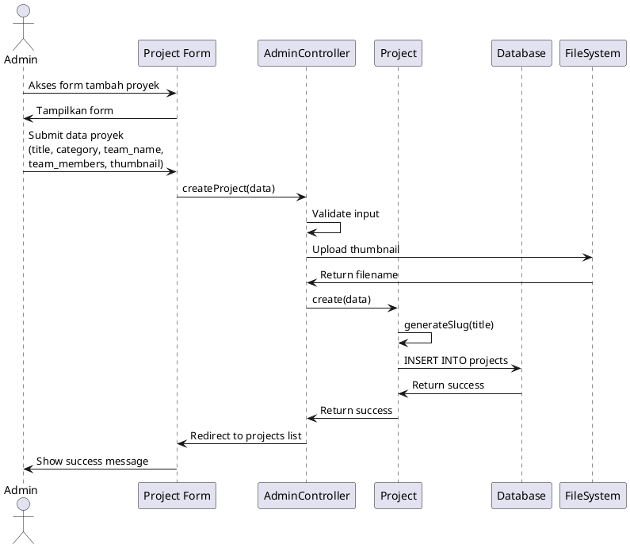
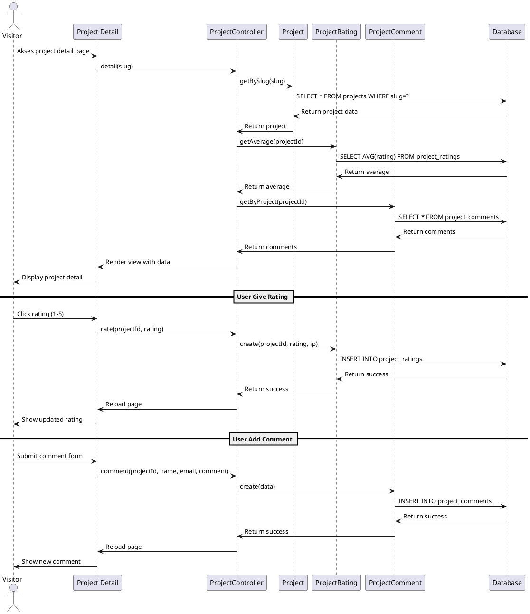
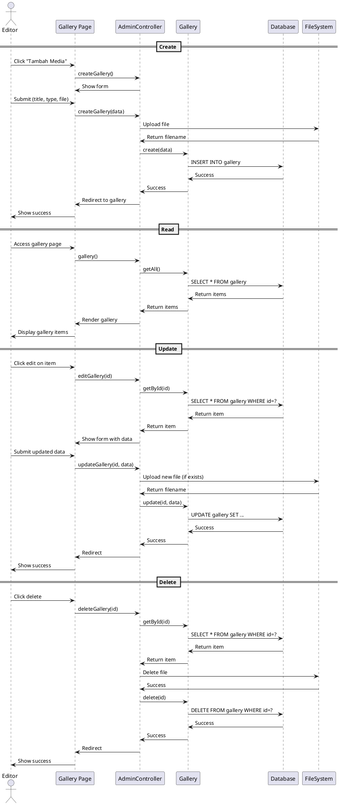

# Sequence Diagram - Lab MMT

## 1. User Login Sequence

```plantuml
@startuml
actor Admin
participant "Login Page" as LP
participant AuthController
participant User as UserModel
participant Database
participant Session

Admin -> LP: Akses halaman login
LP -> Admin: Tampilkan form login

Admin -> LP: Submit (email, password)
LP -> AuthController: login(email, password)
AuthController -> UserModel: getByEmail(email)
UserModel -> Database: SELECT * FROM users WHERE email=?
Database -> UserModel: Return user data
UserModel -> AuthController: Return user

AuthController -> AuthController: Verify password
alt Password Valid
    AuthController -> Session: Set user session
    Session -> AuthController: Session created
    AuthController -> LP: Redirect to dashboard
    LP -> Admin: Show dashboard
else Password Invalid
    AuthController -> LP: Redirect with error
    LP -> Admin: Show error message
end

@enduml
```

## 2. Create Project Sequence

```plantuml
@startuml
actor Admin
participant "Project Form" as PF
participant AdminController
participant Project as ProjectModel
participant Database
participant FileSystem

Admin -> PF: Akses form tambah proyek
PF -> Admin: Tampilkan form

Admin -> PF: Submit data proyek\n(title, category, team_name,\nteam_members, thumbnail)
PF -> AdminController: createProject(data)

AdminController -> AdminController: Validate input
AdminController -> FileSystem: Upload thumbnail
FileSystem -> AdminController: Return filename

AdminController -> ProjectModel: create(data)
ProjectModel -> ProjectModel: generateSlug(title)
ProjectModel -> Database: INSERT INTO projects
Database -> ProjectModel: Return success
ProjectModel -> AdminController: Return success

AdminController -> PF: Redirect to projects list
PF -> Admin: Show success message

@enduml
```

## 3. View Project Detail with Rating & Comment

```plantuml
@startuml
actor Visitor
participant "Project Detail" as PD
participant ProjectController
participant Project as ProjectModel
participant ProjectRating
participant ProjectComment
participant Database

Visitor -> PD: Akses project detail page
PD -> ProjectController: detail(slug)

ProjectController -> ProjectModel: getBySlug(slug)
ProjectModel -> Database: SELECT * FROM projects WHERE slug=?
Database -> ProjectModel: Return project data
ProjectModel -> ProjectController: Return project

ProjectController -> ProjectRating: getAverage(projectId)
ProjectRating -> Database: SELECT AVG(rating) FROM project_ratings
Database -> ProjectRating: Return average
ProjectRating -> ProjectController: Return average

ProjectController -> ProjectComment: getByProject(projectId)
ProjectComment -> Database: SELECT * FROM project_comments
Database -> ProjectComment: Return comments
ProjectComment -> ProjectController: Return comments

ProjectController -> PD: Render view with data
PD -> Visitor: Display project detail

== User Give Rating ==
Visitor -> PD: Click rating (1-5)
PD -> ProjectController: rate(projectId, rating)
ProjectController -> ProjectRating: create(projectId, rating, ip)
ProjectRating -> Database: INSERT INTO project_ratings
Database -> ProjectRating: Return success
ProjectRating -> ProjectController: Return success
ProjectController -> PD: Reload page
PD -> Visitor: Show updated rating

== User Add Comment ==
Visitor -> PD: Submit comment form
PD -> ProjectController: comment(projectId, name, email, comment)
ProjectController -> ProjectComment: create(data)
ProjectComment -> Database: INSERT INTO project_comments
Database -> ProjectComment: Return success
ProjectComment -> ProjectController: Return success
ProjectController -> PD: Reload page
PD -> Visitor: Show new comment

@enduml
```

## 4. Manage Gallery (CRUD) Sequence

```plantuml
@startuml
actor Editor
participant "Gallery Page" as GP
participant AdminController
participant Gallery as GalleryModel
participant Database
participant FileSystem

== Create ==
Editor -> GP: Click "Tambah Media"
GP -> AdminController: createGallery()
AdminController -> GP: Show form

Editor -> GP: Submit (title, type, file)
GP -> AdminController: createGallery(data)
AdminController -> FileSystem: Upload file
FileSystem -> AdminController: Return filename
AdminController -> GalleryModel: create(data)
GalleryModel -> Database: INSERT INTO gallery
Database -> GalleryModel: Success
GalleryModel -> AdminController: Success
AdminController -> GP: Redirect to gallery
GP -> Editor: Show success

== Read ==
Editor -> GP: Access gallery page
GP -> AdminController: gallery()
AdminController -> GalleryModel: getAll()
GalleryModel -> Database: SELECT * FROM gallery
Database -> GalleryModel: Return items
GalleryModel -> AdminController: Return items
AdminController -> GP: Render gallery
GP -> Editor: Display gallery items

== Update ==
Editor -> GP: Click edit on item
GP -> AdminController: editGallery(id)
AdminController -> GalleryModel: getById(id)
GalleryModel -> Database: SELECT * FROM gallery WHERE id=?
Database -> GalleryModel: Return item
GalleryModel -> AdminController: Return item
AdminController -> GP: Show form with data

Editor -> GP: Submit updated data
GP -> AdminController: updateGallery(id, data)
AdminController -> FileSystem: Upload new file (if exists)
FileSystem -> AdminController: Return filename
AdminController -> GalleryModel: update(id, data)
GalleryModel -> Database: UPDATE gallery SET ...
Database -> GalleryModel: Success
GalleryModel -> AdminController: Success
AdminController -> GP: Redirect
GP -> Editor: Show success

== Delete ==
Editor -> GP: Click delete
GP -> AdminController: deleteGallery(id)
AdminController -> GalleryModel: getById(id)
GalleryModel -> Database: SELECT * FROM gallery WHERE id=?
Database -> GalleryModel: Return item
GalleryModel -> AdminController: Return item

AdminController -> FileSystem: Delete file
FileSystem -> AdminController: Success

AdminController -> GalleryModel: delete(id)
GalleryModel -> Database: DELETE FROM gallery WHERE id=?
Database -> GalleryModel: Success
GalleryModel -> AdminController: Success
AdminController -> GP: Redirect
GP -> Editor: Show success

@enduml
```

